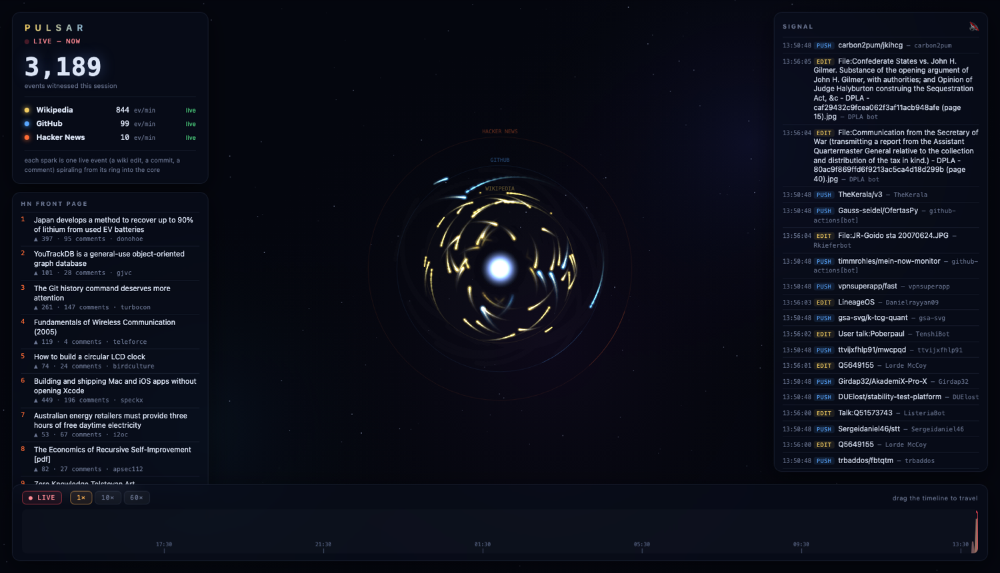
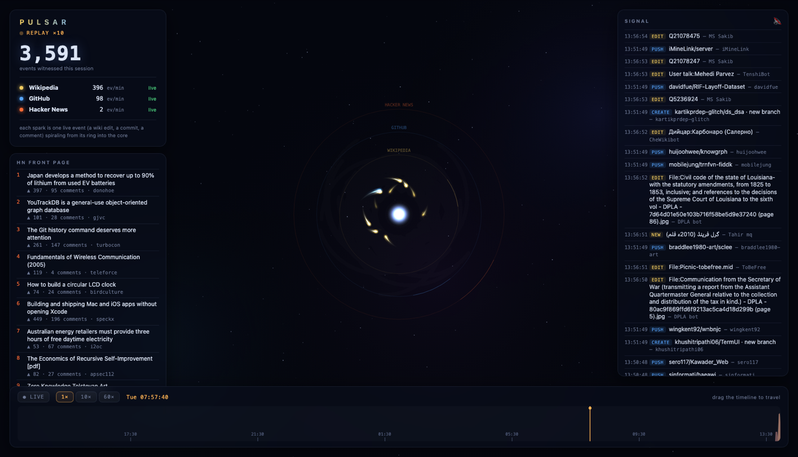

# Pulsar

**The internet has a heartbeat. This is what it looks like.**

Pulsar ingests three live public event streams at once — every Wikipedia edit worldwide,
the GitHub public events feed, and every Hacker News story and comment — stores them as a
time series, and renders them as a deep-space particle radar. Each spark is one real event,
spiraling from its ring into a core that breathes with the internet's pulse. A 24-hour
scrubber lets you drag back to any moment and replay it: *what did the internet look like at
3am?*

<p align="center">
  
  <br>
  <em>Live view — sparks spiral inward from the Wikipedia, GitHub, and Hacker News rings.</em>
</p>

<p align="center">
  <sub>Zero runtime dependencies. Node 23.4+ and a browser. That is the whole stack.</sub>
</p>

---

## Contents

- [Quick start](#quick-start)
- [Using Pulsar](#using-pulsar) — the manual
  - [Reading the radar](#reading-the-radar)
  - [The heads-up display](#the-heads-up-display)
  - [The signal ticker and front page](#the-signal-ticker-and-front-page)
  - [Time travel](#time-travel)
  - [Sound](#sound)
- [The three firehoses](#the-three-firehoses)
- [Configuration](#configuration)
- [Architecture](#architecture)
- [API](#api)
- [Project layout](#project-layout)
- [How it works, in detail](#how-it-works-in-detail)
- [Requirements](#requirements)

---

## Quick start

```bash
npm start          # then open http://localhost:4646
```

There is nothing to install — no `npm install`, no build step. Pulsar uses only Node
built-ins (`node:sqlite`, `node:http`, `fetch`) and vanilla canvas.

```bash
GITHUB_TOKEN=ghp_... npm start     # optional: raises the GitHub poll rate from 60s to 15s
PORT=8080 npm start                # optional: serve on a different port
```

On first launch the three ingesters connect and the radar starts filling within a few
seconds. Wikipedia is the loudest stream and lights up almost immediately; GitHub and
Hacker News drip in as their pollers cycle.

---

## Using Pulsar

Everything is on one screen. Here is what each part does.

### Reading the radar

The center of the screen is a radar with three concentric rings, one per source:

| Ring | Source | Color |
|---|---|---|
| Inner | Wikipedia | amber |
| Middle | GitHub | blue |
| Outer | Hacker News | orange |

Every real event spawns one spark on its source's ring. The spark spirals inward and
dissolves into the **core** — the bright point at the center. The core breathes: it swells
with the combined throughput of all three streams, so a busy minute on the internet is a
brighter, larger pulse. Genuinely notable events (a new HN story, a GitHub release, a large
Wikipedia edit) briefly float their title next to the ring; routine housekeeping edits are
filtered out so the labels stay readable.

### The heads-up display

Top-left panel:

- **Big counter** — total events witnessed this session, easing upward like an odometer.
- **Mode indicator** — `LIVE — NOW` when following the live feed, `REPLAY ×N` when time
  traveling, `RECONNECTING…` if the stream drops.
- **Per-source rates** — live events-per-minute for Wikipedia, GitHub, and Hacker News,
  each with a status light (`live`, `connecting`, or a fault state).

### The signal ticker and front page

- **SIGNAL** (right panel) — a scrolling feed of individual events as they arrive: the
  event type, its title (a clickable link to the source), and the actor. The Wikipedia
  firehose is throttled here so it does not drown out GitHub and Hacker News.
- **HN FRONT PAGE** (lower-left panel) — the current Hacker News top ten, with score,
  comment count, and author. It refreshes on its own every few minutes.

Every headline in both panels is a real link — click to open the source in a new tab.

### Time travel

The bar across the bottom is a 24-hour timeline showing a stacked area chart of activity
per minute. Drag it to travel back in time and replay any moment through the same radar.

<p align="center">
  
  <br>
  <em>Time travel — replaying the early-morning hours at 10x, playhead parked mid-timeline.</em>
</p>

| Control | What it does |
|---|---|
| **Drag the timeline** | Jump to that moment and start replaying from there |
| **`1×` / `10×` / `60×`** | Set playback speed (real-time, ten times, sixty times) |
| **`● LIVE`** | Snap back to the live feed |
| Reaching the present | Replay catches up to now and returns you to live automatically |

While replaying, the playhead and historical ticker entries turn amber so you always know
you are looking at the past, not the present.

### Sound

The speaker button in the header of the SIGNAL panel toggles event sounds. When on, new
Hacker News stories and GitHub releases play a short blip. It starts muted.

---

## The three firehoses

| Source | What it carries | Transport | Cadence |
|---|---|---|---|
| **Wikipedia** | every edit on every wiki, worldwide | Wikimedia EventStreams (SSE) | roughly 30–50 events/sec, continuous |
| **GitHub** | pushes, PRs, releases, stars across all public repos | REST, ETag-conditional polling | pages of ~30–100 events, dripped across the poll window |
| **Hacker News** | every story and comment as it is posted | Firebase REST (sequential item ids) | polled every 20s |

---

## Configuration

| Variable | Default | Effect |
|---|---|---|
| `PORT` | `4646` | HTTP port to listen on |
| `GITHUB_TOKEN` | *(none)* | If set, authenticates GitHub polling and raises the poll rate from 60s to 15s |

Both are optional. Pulsar runs fully unauthenticated out of the box.

---

## Architecture

```
 wikimedia SSE ─┐                       ┌─ SSE /api/live ──► browser
 github poll  ──┤► hub (normalize, ─────┤   /api/history      canvas engine:
 hn poll      ──┘   rate counters)      │   /api/replay       starfield · spiral
                        │               └─ /api/stats         particles · ticker ·
                        ▼                                     time-travel scrubber
                SQLite (node:sqlite, WAL)
                ├─ events         raw rows, 48h retention
                └─ rollup_minute  per-minute counts, kept forever
```

The Wikipedia firehose alone would be about 4M rows/day if stored raw, so storage is tiered:

- **`rollup_minute`** counts *every* event from *every* stream, forever. Rows are
  `(minute, source, count)`. A full year of all three firehoses fits in a few hundred MB at
  most, and the 24h timeline reads it with one indexed range scan.
- **`events`** keeps raw rows for replay: all GitHub and Hacker News events, but only
  *human* (non-bot) Wikipedia edits. Anything older than 48 hours is pruned every 10
  minutes.
- Live particles render the **full** firehose (broadcast is not the same as stored); replay
  renders the sampled raw retention. Counting everything while storing selectively is the
  trick.

---

## API

| Endpoint | Returns |
|---|---|
| `GET /api/live` | SSE: a snapshot, then every event plus rates every 2s |
| `GET /api/history?hours=24` | per-minute rollups (the timeline) |
| `GET /api/replay?ts=<ms>&window=<ms>` | raw events around a timestamp (time travel) |
| `GET /api/stats` | totals, rates, top wiki pages (last hour), HN front page |

---

## Project layout

```
src/
  server.js            HTTP + static + SSE broadcast + JSON APIs
  hub.js               event bus, session totals, per-second rate ring
  db.js                node:sqlite schema, rollups, replay queries, pruning
  ingest/
    wikipedia.js       EventStreams SSE consumer (reconnect + backoff)
    github.js          ETag-conditional poller with drip scheduling
    hackernews.js      sequential item-id poller + front page tracker
public/
  index.html           HUD, ticker, front page, time-travel bar
  app.js               canvas engine: starfield, particles, timeline, replay
  style.css            deep-space theme
docs/
  pulsar-live.png      screenshots used in this README
  pulsar-replay.png
```

---

## How it works, in detail

<details>
<summary><b>Polite GitHub polling</b></summary>

<br>

Unauthenticated callers get 60 requests/hour, but conditional requests answered with
`304 Not Modified` do not count against that limit. Pulsar polls with an `If-None-Match`
ETag, so most polls are free. It also honors GitHub's `X-Poll-Interval` hint and backs off
on the rate-limit reset headers when throttled.

</details>

<details>
<summary><b>Clump smoothing</b></summary>

<br>

Polled sources (GitHub, Hacker News) deliver bursts of dozens of events at once. If those
were rendered on arrival, the visualization would beat in clumps instead of reflecting the
real cadence. The ingesters drip each batch out across the poll window so the radar feels
continuous.

</details>

<details>
<summary><b>Live rates without touching the database</b></summary>

<br>

Events-per-minute figures come from a 120-slot, per-second ring buffer held in memory — not
from a database query. The rollup table is only read for the 24-hour timeline.

</details>

<details>
<summary><b>Time travel mechanics</b></summary>

<br>

Replay streams 10-minute chunks of raw events and plays them against a virtual clock at 1x,
10x, or 60x, prefetching the next chunk before the clock reaches it. When the virtual clock
catches up to the present, Pulsar seamlessly returns you to the live feed.

</details>

<details>
<summary><b>Hidden-tab correctness</b></summary>

<br>

Browsers pause `requestAnimationFrame` in background tabs. Ingestion and rendering are fully
decoupled, so events are never stockpiled into a single particle burst when you tab back in
— the radar simply resumes from the present.

</details>

<details>
<summary><b>Zero dependencies</b></summary>

<br>

`node:sqlite`, `fetch`, `node:http`, hand-rolled SSE parsing in both directions, and vanilla
canvas. No build step, nothing to install.

</details>

---

## Requirements

- **Node 23.4 or newer** (for the built-in `node:sqlite` module)
- A modern browser

To regenerate the screenshots in this README, run the app and capture the live view and a
replay of any past moment.
